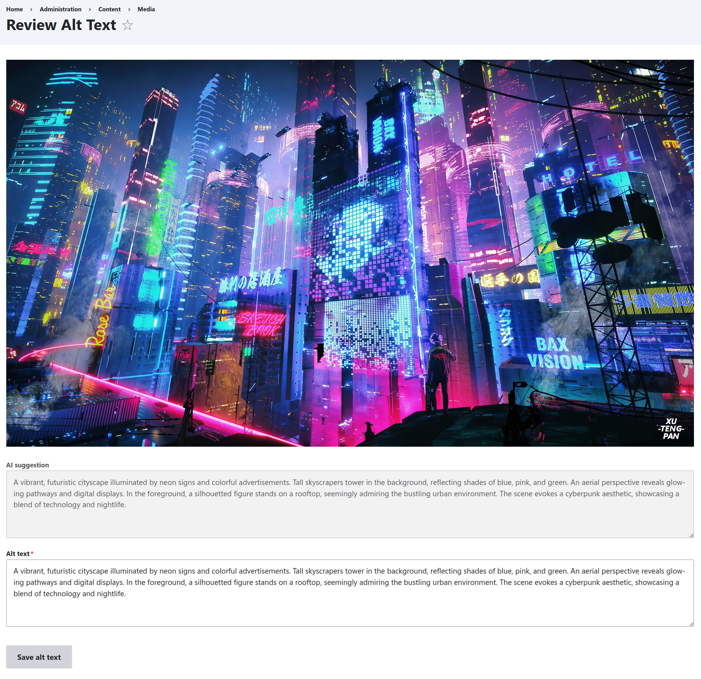

# Drupal AI Alt Text Generator Module

Provides AI‑generated alt text suggestions for images without alt text in the media library, with a human review workflow.



## Requirements

- Drupal 10  
- PHP 7.4 or higher  
- PHP extensions: cURL, GD or Imagick  
- OpenAI API key  

## Installation

### 1. Via Composer (recommended)

1. In your Drupal site’s root `composer.json`, add the repository entry:
   ```json
   {
     "repositories": [
       {
         "type": "vcs",
         "url": "https://github.com/RAOEUS/drupal-ai-alt-text-generator"
       }
     ]
   }

2. Require the module:

   ```bash
   composer require raoeus/drupal-ai-alt-text-generator:^1.0
   ```
3. The module will be installed into `web/modules/contrib/alt_text_review/`.
4. Enable the module and clear caches:

   ```bash
   drush en alt_text_review -y
   drush cr
   ```
5. Assign the **Access Alt Text Review UI** permission to the appropriate roles.

### 2. Manual Install

1. Clone or download this repository into your Drupal installation:

   ```bash
   git clone https://github.com/RAOEUS/drupal-ai-alt-text-generator.git web/modules/contrib/alt_text_review
   ```
2. Enable the module and clear caches:

   ```bash
   drush en alt_text_review -y
   drush cr
   ```
3. Assign the **Access Alt Text Review UI** permission to the appropriate roles.

## Configuration

Visit **Configuration » Media » Alt Text Review Configuration** (`/admin/config/media/alt-text-review`) and configure:

* **OpenAI API key**
* **AI Prompt**

  > A template for the AI, with the token `[max_length]` replaced by your max‑length setting.
* **Alt text maximum character length**

  > Integer value (default 128) that replaces `[max_length]` in your prompt.
* **Enable debug logging**

  > Logs full request/response payloads when checked. Disable in production.

## Usage

Go to **Configuration » Media » Alt Text Review** (`/admin/content/media/alt-text-review`):

1. The module queries for the first media item of type **Image** where `field_media_image.alt` is empty or NULL.
2. It **automatically downscales** the image to fit within an 800 × 800 px box (preserving aspect ratio) to limit payload size.
3. The downscaled image is base64‑encoded and sent, along with your prompt, to the AI.
4. You see the image plus the AI’s suggested alt text.
5. Edit or accept the suggestion and **Save alt text**. You’re redirected to the next image without alt text.

## How It Works

1. **Discovery**
   Runs an entity query for `media` bundle `image` where the alt field is empty.
2. **Downscaling**
   Uses Drupal’s ImageFactory to load the file and resize it so neither width nor height exceeds 800 px.
3. **Encoding**
   Reads the (downscaled) image file, base64‑encodes it, and wraps it in a `data:` URI.
4. **Prompt Assembly**
   Injects your max‑length setting into the prompt template.
5. **API Call**
   Sends a Chat Completion request to `https://api.openai.com/v1/chat/completions` with:

   * **model**: `gpt-4o-mini`
   * **messages**:

     ```json
     [
       {
         "role": "user",
         "content": [
           { "type": "text",  "text": "Your prompt here" },
           { "type": "image_url", "image_url": { "url": "data:image/..." } }
         ]
       }
     ]
     ```
   * **max\_tokens**: calculated from your max length.
6. **Error Handling**

   * Missing API key → early error message.
   * File not found → log and fallback message.
   * Request failure → log details if debug enabled, show generic error.
7. **Review & Save**
   The form lets you tweak or accept the AI suggestion and saves it to the media entity’s `alt` attribute.

## Model and Pricing

This module uses **GPT‑4o mini**, priced at:

* **\$0.15 per 1 M input tokens**
* **\$0.60 per 1 M output tokens**

Because images are downscaled to 800×800 px, a typical JPEG (\~50 KB) yields about 68 000 base64 characters (≈17 000 tokens). With a 32‑token response, the cost per image is:

```text
Input cost  = (17 000 / 1 000 000) × $0.15 ≈ $0.00255  
Output cost = (   32 / 1 000 000) × $0.60 ≈ $0.00002  
Total ≈ $0.00257 per image
```

> To further reduce cost, you can lower the downscale dimensions or adjust JPEG quality via your image styles.

## License

GPL‑2.0 or later.
